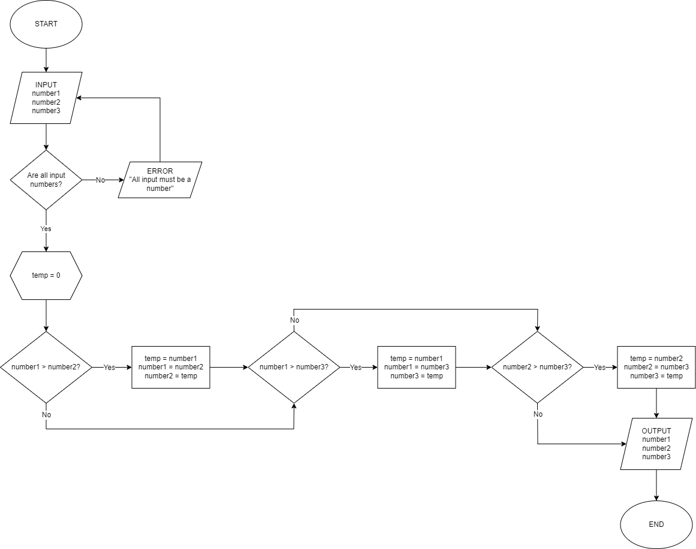
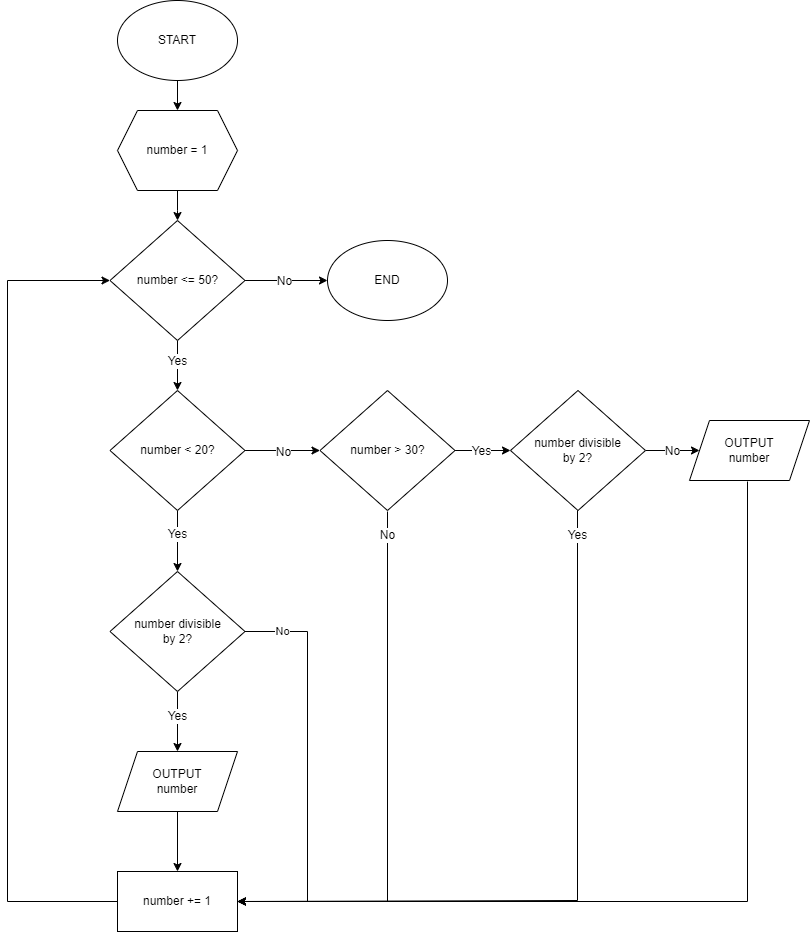
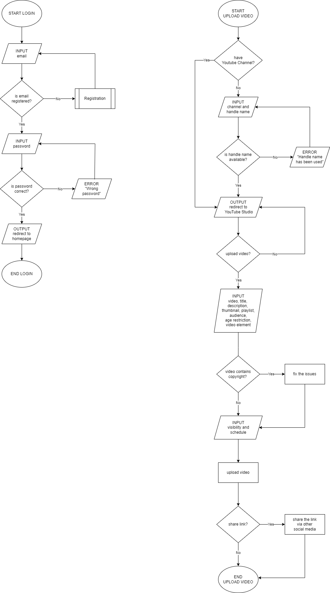
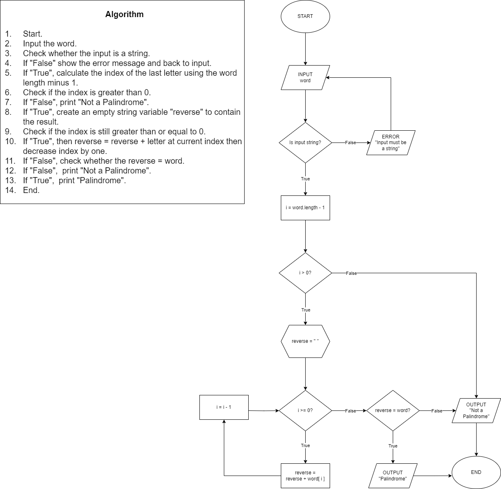
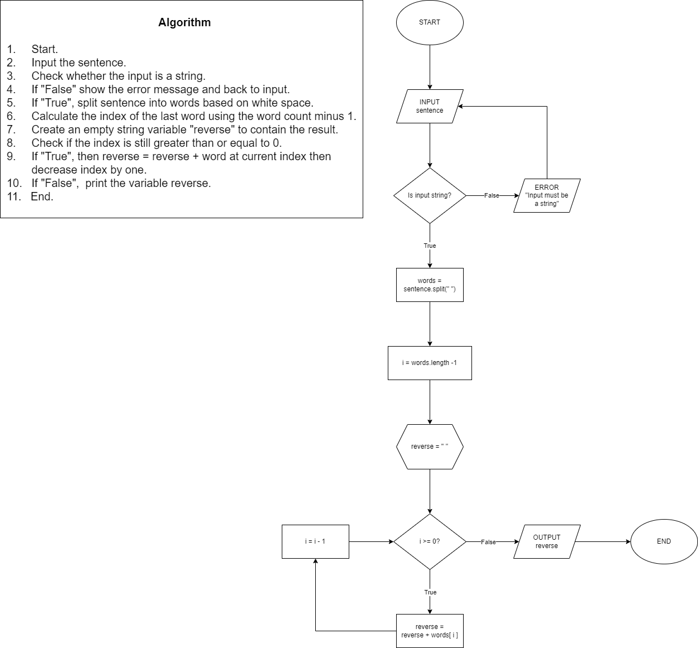

<h1 align="center">
  Algorithm Tasks 🔄
</h1>

<h2>
  1. Sort Three Numbers in Ascending Order
</h2>

<h2>
  2. Odd or Even Numbers
</h2>

<h2>
  3. Upload Youtube Video
</h2>

<h2>
  4. Palindrome
</h2>

<h2>
  5. Reverse Words
</h2>

